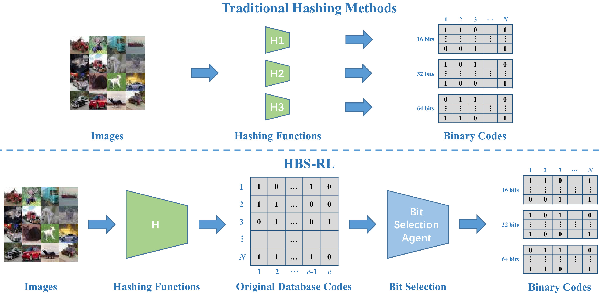

# Hash Bit Selection with Reinforcement Learning
We release all cods and configurations for HBS-RL. For details, see **Hash Bit Selection with Reinforcement Learning**

<div align=center></div>

## Requirements

    - PyTorch
    - tmuxp    

## Preparation

### Construt Bit Pool

#### MNIST

Feature & LSH
```bash
python3 hmethod/hash_baseline/features/mnist.py
```
ITQ, SpH
```bash
python3 hmethod/hash_baseline/features/hash_baseline.py --methods ITQ SpH
```

#### Cifar10
Feature
```bash
python3 hmethod/hash_baseline/features/cifar10.py
```
SH, ITQ, SpH
```bash
python3 hmethod/hash_baseline/features/hash_baseline.py --dataset cifar10
```
Merge book
```bash
python3 hmethod/hash_baseline/features/sh-sph-itq-merge.py
```

#### Imagenet & Nus-Wide

Prepare **Feature** and **Book** files like MNIST and Cifar10
##### Feature files
```bash
cd hmethod/dataset/feature/
python3 feature.py --dataset imagenet
python3 feature.py --dataset nuswide
```
##### Book files
Reference [DPSH](https://github.com/TreezzZ/DPSH_PyTorch), [GreedyHash](https://github.com/ssppp/GreedyHash), and [CSQ](https://github.com/yuanli2333/Hadamard-Matrix-for-hashing) with codes in `./hmethod/dataset`

## Training & Testing

Train HBS-RL
```bash
tmuxp load scripts/algo-hbs-rl/mnist_train.yaml
```
Test & Evaluation
```bash
tmuxp load scripts/algo-hbs-rl/test.yaml
```

### Plot the entropy curves
```bash
for bit in {32,64,128};do
python3 ./scripts/plot.py ./data/checkpoint/mnist/LSH/entropy/ -cf 1 -lf progress.txt -x Episode -y MAP_TRAIN -i $bit -s 100 -o 0.05 -S 1 -L '$\alpha=0$' '$\alpha=0.01$' '$\alpha=0.02$' '$\alpha=0.03$' '$\alpha=0.04$' -T MNIST' @ '$bit' bits' -yl 'MAP (Train)' -cl 'HBS-RL (LSH):' -cL left -LL 'lower right' -p ent_$bit.pdf;done
```

```bash
python3 main.py --datasets mnist --hmethods lsh --num_bits 512 --num_sub_bits 64 --topK 0
python3 main_ppo.py --num_bits '512' --num_sub_bits '128' --dataset 'mnist' --hmethod 'lsh' --device 'cuda:5'
```

### Plot Precision Recall P-R
```bash
python3 evaluate.py --plot True --dataset mnist --method LSH{PPO_NDomSet_Random}512 --num_bit 32 --topK 50000 --device cuda:0
python3 evaluate.py --plot True --dataset mnist --method SpH{PPO_NDomSet_Random}512 --num_bit 32 --topK 50000 --device cuda:0
```
